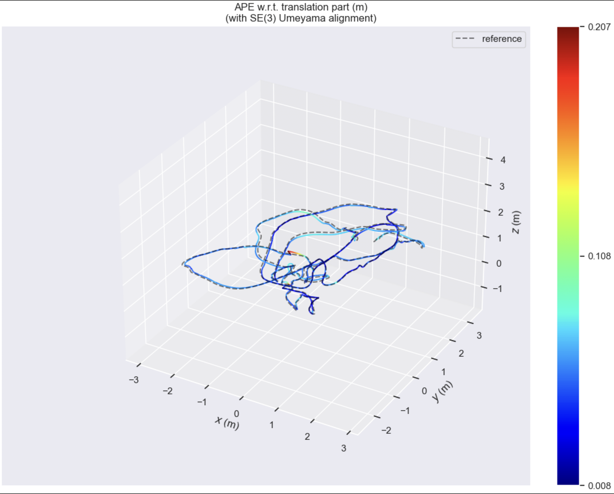
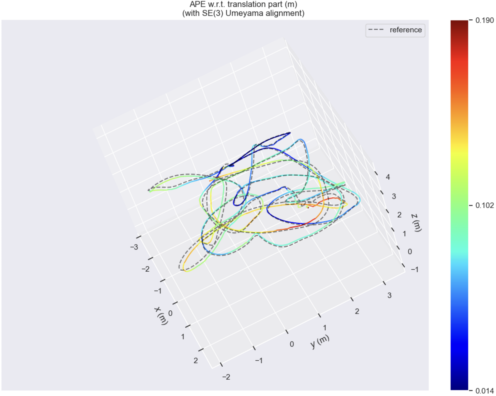
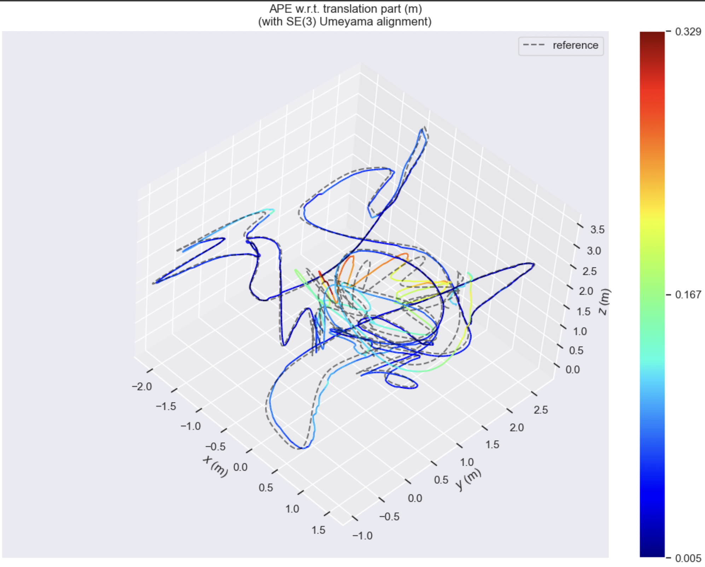
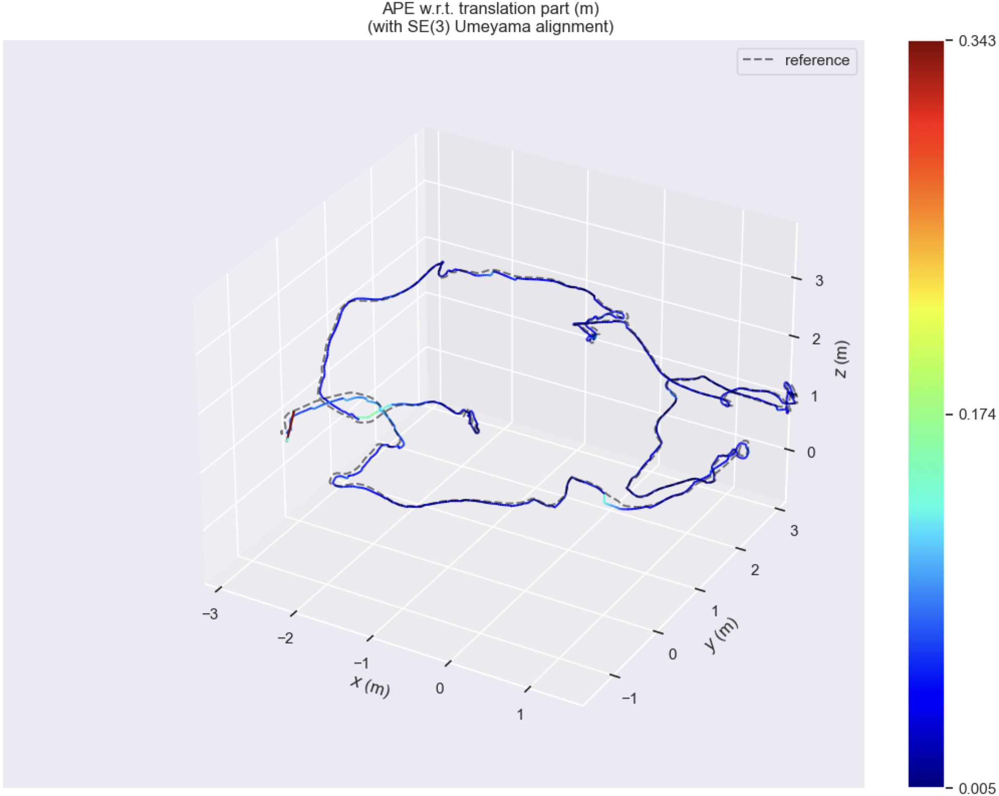
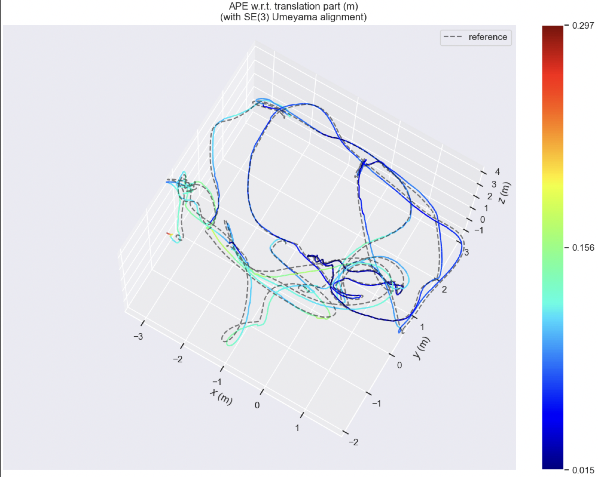
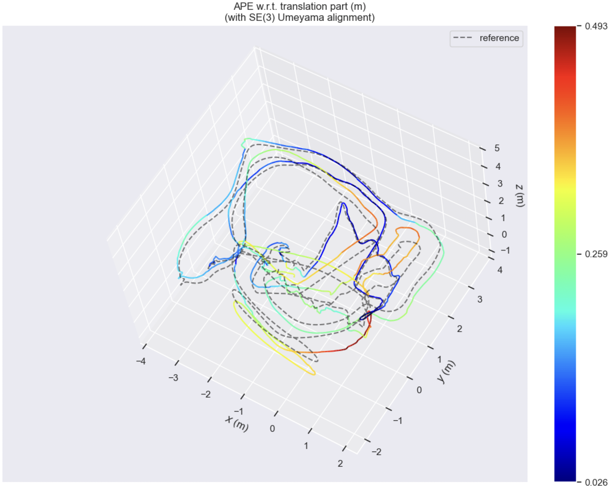
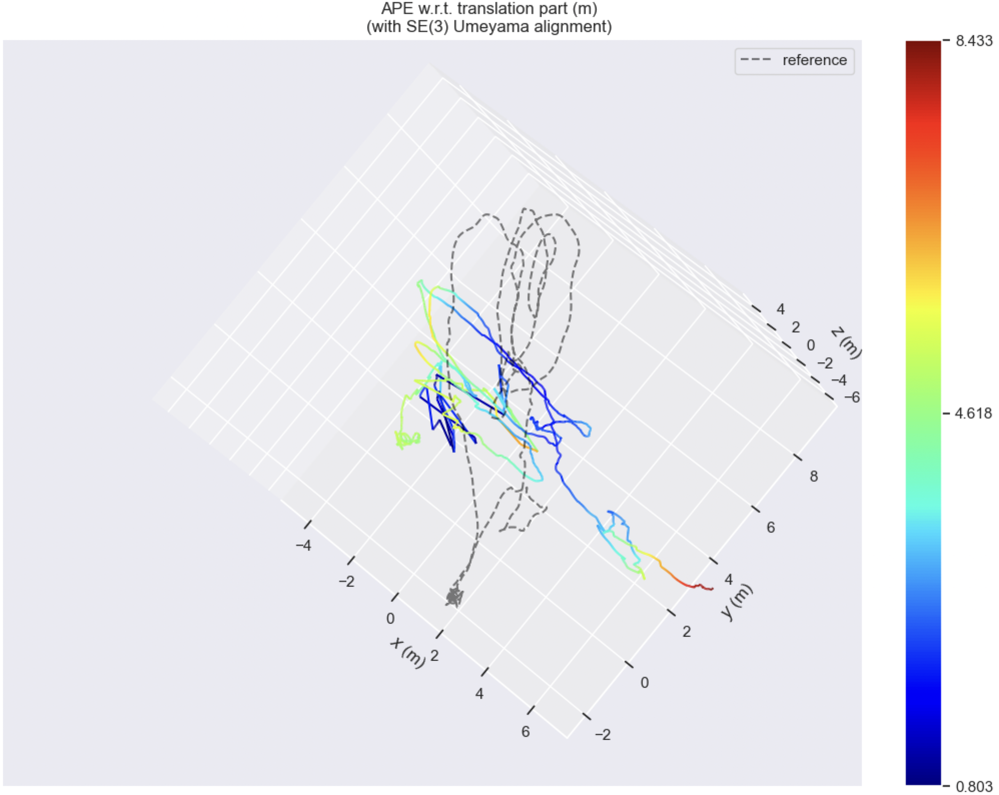
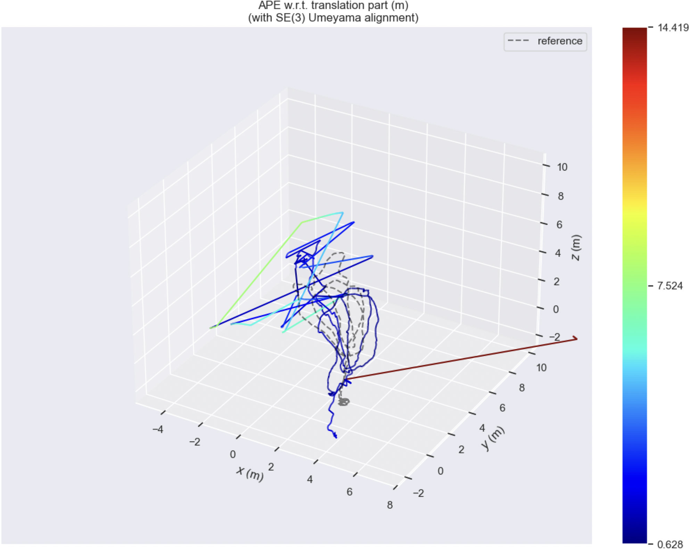
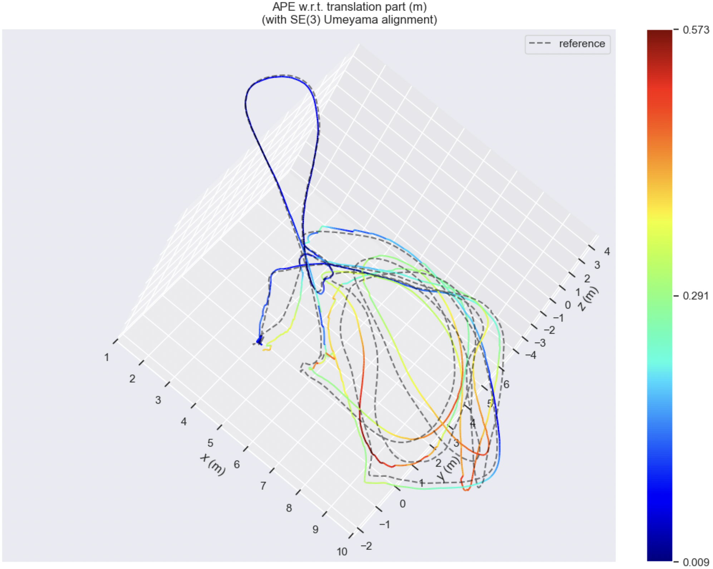
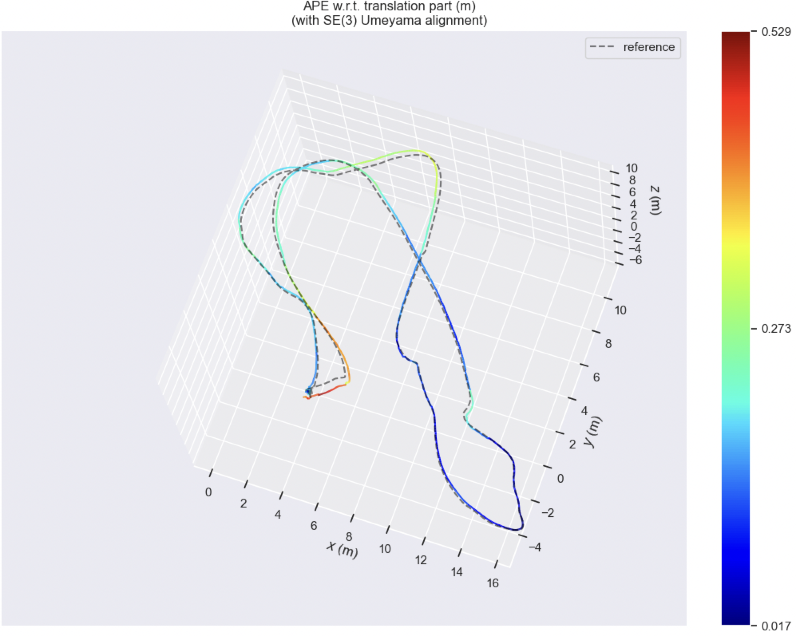

# slam-playground

A research playground for building a stereo **visual-inertial odometry / SLAM** pipeline from scratch: stereo VO frontend, IMU preintegration and factor-graph smoothing (GTSAM), loop closure detection, and pose-graph optimization, evaluated against the EuRoC MAV benchmark.

> Status: active R&D project. Interfaces, profiles, and evaluation numbers below change as the pipeline evolves.

## Demo

```bash
just dataset fetch euroc_v101 # download euroc dataset from source and prepare
just pipeline run --profile my_slam_euroc --dataset euroc_v101 --fraction 1 # run pipeline
just pipeline start # in another terminal to start processing
```


_(Stereo VO + IMU factor-graph smoothing running on the EuRoC V1_01 sequence, visualized in Rerun.)_

## EuRoC Evaluation

Trajectory accuracy is measured as offline **Absolute Pose Error (APE)** against EuRoC ground truth, using [evo](https://github.com/MichaelGrupp/evo) with SE(3) Umeyama alignment:

```bash
just pipeline run --profile full_batch_profile --dataset euroc_v101 --viz file # run full dataset, stream in rerun *.rdd file
just eval ape -p
```

| Selector     | Sequence        | Success | Difficulty | RMSE (m) | Max (m)   | Trajectory |
| ------------ | --------------- | ------- | ---------- | -------- | --------- | ---------- |
| `euroc_v101` | Vicon Room 1_01 | ✅ | easy | 0.057589 | 0.207468 | <a href="./results/euroc_v101_traj.png"></a> |
| `euroc_v102` | Vicon Room 1_02 | ✅ | medium | 0.100596 | 0.189849 | <a href="./results/euroc_v102_traj.png"></a> |
| `euroc_v103` | Vicon Room 1_03 | ✅ | difficult | 0.107480 | 0.328875 | <a href="./results/euroc_v103_traj.png"></a> |
| `euroc_v201` | Vicon Room 2_01 | ✅ | easy | 0.055425 | 0.343160 | <a href="./results/euroc_v201_traj.png"></a> |
| `euroc_v202` | Vicon Room 2_02 | ✅ | medium | 0.104152 | 0.296828 | <a href="./results/euroc_v202_traj.png"></a> |
| `euroc_v203` | Vicon Room 2_03 | ✅ | difficult | 0.255578 | 0.492918 | <a href="./results/euroc_v203_traj.png"></a> |
| `euroc_mh01` | Machine Hall 01 | ⚠️ | easy | 4.176220 | 8.432641 | <a href="./results/euroc_mh01_traj.png"></a> |
| `euroc_mh02` | Machine Hall 02 | ⚠️ | easy | 2.096966 | 14.419447 | <a href="./results/euroc_mh02_traj.png"></a> |
| `euroc_mh03` | Machine Hall 03 | ✅ | medium | 0.277618 | 0.572801 | <a href="./results/euroc_mh03_traj.png"></a> |
| `euroc_mh04` | Machine Hall 04 | ✅ | difficult | 0.234541 | 0.526853 | <a href="./results/euroc_mh04_traj.png"></a> |
| `euroc_mh05` | Machine Hall 05 | ❌ | difficult | _TBD_ | _TBD_ | — |

✅ completed · ⚠️ moderate (completes, but degraded accuracy) · ❌ failed (no usable trajectory)

The CI regression gate (`tests/regress/vo_stereo/test_euroc_v101.py`) currently requires RMSE < 0.30 m, mean < 0.20 m, max < 1.00 m on `euroc_v101` at 5% of the sequence.

## Pipeline

```text
control (HTTP or Zenoh) -> dataset -> vio_frontend -> vio_backend -> loop_closure -> pgo -> slam_output -> trajectory_evaluator / rerun
```

- **Frontend (VO):** FAST feature detection, LK optical flow, forward/backward checks, essential-matrix RANSAC, stereo LK matching, keyframe selection, IMU preintegration, zero-velocity/static initialization, and frame-to-frame PnP tracking seeded from stereo-triangulated landmarks.
- **Backend:** GTSAM factor-graph optimization (`IncrementalFixedLagSmoother`) with pose/velocity/bias priors, IMU factors, bias random-walk, stereo projection factors, and ZUPT velocity priors.
- **Loop closure / PGO:** ORB/DBoW3 place recognition, geometric verification, and pose-graph optimization.
- **Visualization:** Rerun (primary), with older Foxglove support.

## Prerequisites

- Python 3.13
- [uv](https://docs.astral.sh/uv/)
- [just](https://github.com/casey/just)

## Installation

```bash
brew install just uv
uv sync
just install-3rdparty   # pydbow3 and other native bindings not tracked by uv.lock
```

Optional — the `vpr-torch` extra (torch + torchvision) is only needed for NetVLAD/VPR experiments:

```bash
uv sync --all-extras
```

See `docs/manual_gtsam_install.md` and `docs/manual_pydbow3_install.md` for manual native-dependency installs if `uv sync` / `just install-3rdparty` don't cover your platform.

## Datasets & results

Dataset selectors are manifest-backed (`datasets/*.yaml`), currently focused on the EuRoC MAV benchmark:

```bash
just dataset list
just dataset fetch euroc_v101
```

## Running the pipeline

```bash
just pipeline run --profile slam_agent_profile --dataset euroc_v101 --fraction 1
```

Profiles under `config/profile/` compose dataset, dataflow template, visualization sink, and run mode — inspect the resolved dataflow before running:

```bash
just profile resolve --profile slam_agent_profile
```

Run logs land in `pipeline/out/<run-id>` (also symlinked as `pipeline/out/latest`), including the Rerun recording (`data.rrd`) and `current-run.json`.

## Known limitations

- **PnP → PIM bootstrap can fail on hard datasets.** PnP drives the ramp-up phase while the smoother estimates accelerometer bias; if PnP loses correspondences or doesn't provide reliable pose updates fast enough, bias may not converge in time and the pipeline never reaches stable inertial-prediction mode.
- **Frame-to-frame PnP degrades at very low stereo ratio.** The PnP store is seeded from stereo-triangulated points, so long stretches with few valid stereo matches leave too few reliable 3D correspondences — especially in close-range scenes with sparse stereo geometry. Planned fix: observation-history based landmark initialization with multi-view GN triangulation instead of per-frame stereo depth.
- **Loop closures can currently increase drift.** With LCD enabled, evaluation results are worse than with it disabled: the ORB/BF pipeline yields too few/inaccurate query-reference correspondences, so geometric verification under-supports alignment and bad loop constraints propagate into PGO. Planned fix: NetVLAD place retrieval with SuperPoint/LightGlue matching for denser, more reliable correspondences.

## Project layout

```text
src/core/           # camera model, feature tracker, front end, pose tracker, GTSAM graph optimizer
src/pipeline/        # dora node plumbing, PipelineContext, Arrow serialization
src/pipeline/nodes/   # runnable dora nodes
src/dataset/         # manifest-backed dataset loading (datasets/*.yaml)
src/evaluation/      # TUM export + evo APE evaluation
src/visualizer/       # Rerun (primary) and Foxglove visualization
pipeline/*.yml       # dora dataflow definitions
config/profile/      # run profiles (dataset + dataflow + viz + run mode)
config/dataset_rig/   # sensor rig calibration (EuRoC, ...)
tests/regress/       # end-to-end regression tests gated on APE metrics
```

## Testing

```bash
just test            # unit + integration
just test-smoke       # CLI smoke tests
just test-regression   # end-to-end pipeline regression, gated on APE metrics
just validate         # format + lint + test
```
